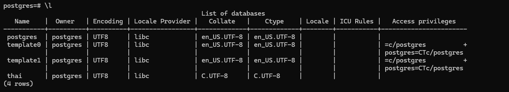
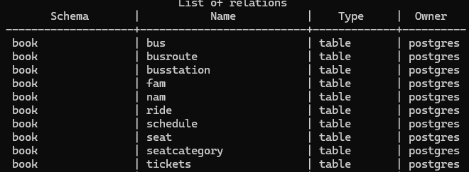
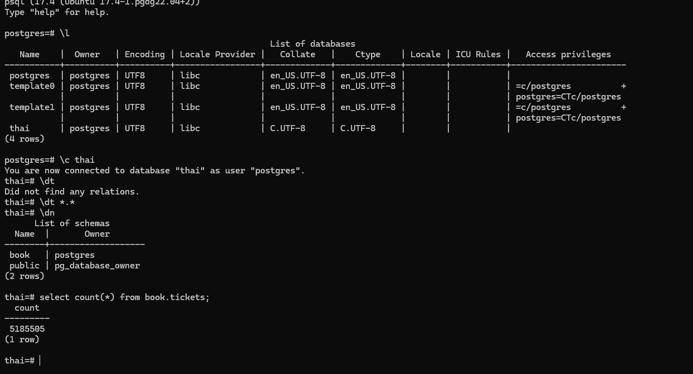

### 1. Развертывание PostgreSQL.

Я  установил себе PostgreSQL 17 на WSL, под Ubuntu 22.04 LTS. Для установки использовал гайд с портала официальной документации Postgres - https://www.postgresql.org/download/linux/ubuntu/.


### 2. Заливка тайский перевозок.

После скачивания архива распаковываю его в домашней папке командой ```tar -xzvf thai_small.tar.gz```.


Перехожу под учетную запись пользователя ```postgres``` в Linux и открываю psql  командой ```sudo -u postgres psql```.

Командой ```\i``` запускаю импорт распакованного .sql файла. 

Проверяю успешность создание БД командой ```\l```.



Подключаюсь к этой БД командой ```\c thai``` и проверяю наличие таблиц командой ```\dt *.*```.




### 3. Делаю запрос к таблице book.tickets



Итого получаем ```5185505``` поездок. 
