### 1, 2, 3. Создаем две сессии подключения к postgresql.
Командами ```sudo -i -u postgres``` и потом ```psql```.
### 4. Создаем в первой сессии новую таблицу.
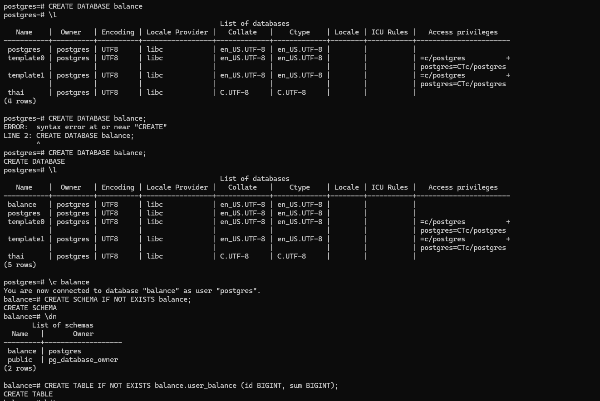

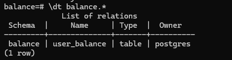

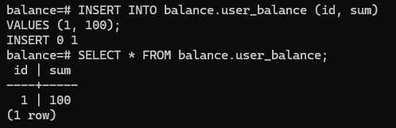

### 5. Смотрим текущий уровень изоляции транзакции.

Смотрим это командой ```SHOW transaction_isolation;```.

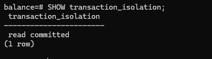


### 6. Начинаем транзакцию в обеих сессиях. 

1-ая консоль:
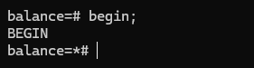

2-ая консоль:
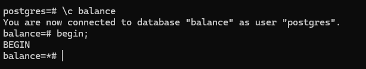

### 7. Добавляем запись в первой сессии.

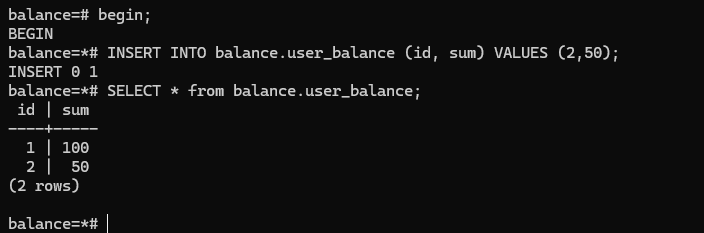

### 8. Сделаем запрос на выборку новых записей во второй сессии.

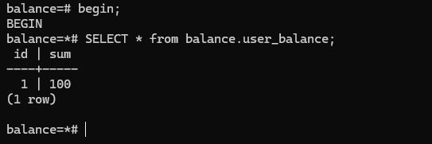

### 9. Видимость новых записей. 

Новая запись не видна во второй транзакции из-за уровня изоляции ```READ COMMITED```. При таком уровне изоляции другим транзакциям видны только **зафиксированные** транзакции. Поскольку для транзакции из первой сессии еще не сделан ```COMMIT```, то изменения из первой сессии не видны второй. 

### 10. Завершим транзакцию в первом окне. 

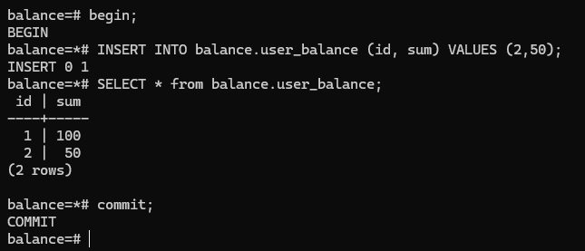

### 11. Делаем запрос на выборку во втором окне. 

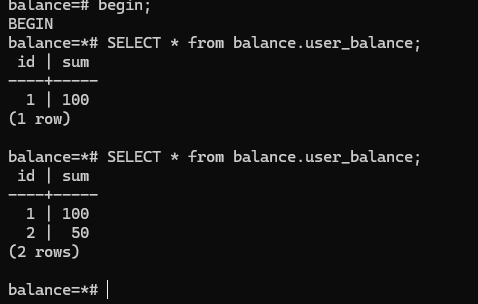

### 12. Видимость новых записей. 

Записи, сделанные в 1-й сессии действительно видны. Это связано с тем, что на уровне изоляции ```READ COMMITED``` другим транзакциям видны закоммиченные изменения. Таким образом, поскольку транзакция из 1-ого окна зафиксировалась, то мы теперь видим её изменения из незавершенной транзакции во 2-м окне. 

### 13. Завершаем транзакцию во 2-ом окне. 

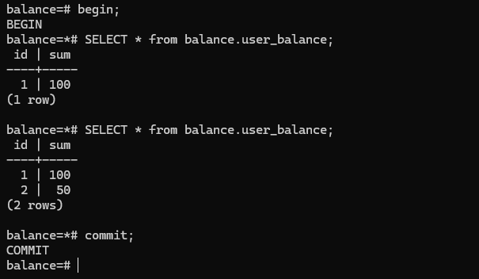

### 14. начинаем транзакции на уровне REPEATABLE READ

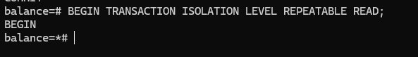

### 15. Добавляем новую запись в 1-ой сессии.

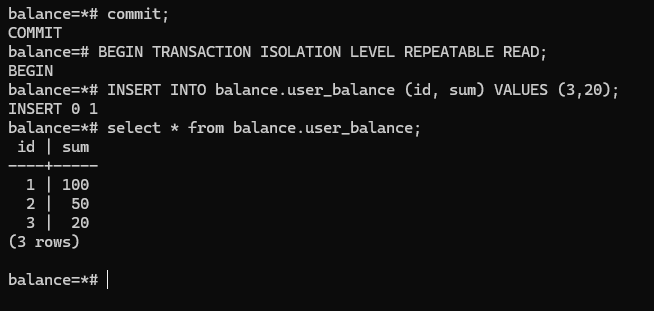

### 16. Делаем запрос на выборку всех записей во 2-ой сессии.

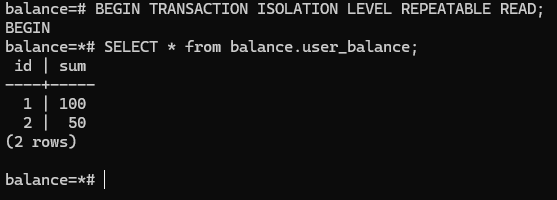

### 17. Видна ли новая запись из 1-ой сессии?

Новая запись не видна во второй транзакции из-за уровня изоляции ```REPEATABLE READ```. Этот уровень изоляции более жесткий, нежели ```READ COMMITED```, а при нем другим транзакциям видны только **зафиксированные** транзакции. Поскольку для транзакции из первой сессии еще не сделан ```COMMIT```, то изменения из первой сессии не видны второй. 

### 18. Завершаем транзакцию в 1-ом окне. 

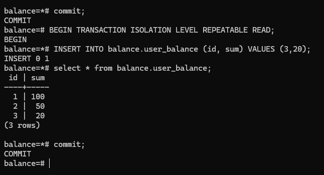

### 19. Делаем запрос на выборку во 2-ом окне. 

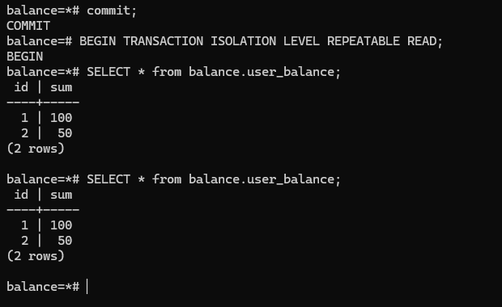

### 20. Видимость новых записей во 2-ом окне. 

Новая запись не видна во 2-ом окне. Это связано с тем, что уровень изоляции ```REPEATABLE READ``` в PostgreSQL обеспечивает защиту от "фантомных чтений". Ситуаций, когда в момент выполнения одной транзакции в таблицу добавляются новые записи, которых не было до этого. В данном примере мы как раз таки пытаемся воспроизвести эту аномалию и видим, что Postgres успешно защищает нашу транзакцию от нее, так как мы работаем на уровне ```REPEATABLE READ```.