### 1. Создаем таблицу с текстовым поле и заполняем ее 1 млн строк.
```
CREATE TABLE balance.tst (
    data TEXT
);

INSERT INTO balance.tst (data)
SELECT md5(random()::text)
FROM generate_series(1, 1000000);
```
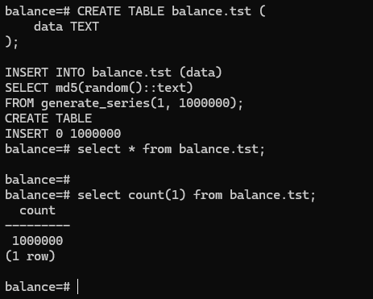
### 2. Смотрим размер файла с таблицей.

```
SELECT 
pg_size_pretty(pg_total_relation_size('balance.tst')) AS total_size, 
pg_size_pretty(pg_relation_size('balance.tst')) as table_size;

```

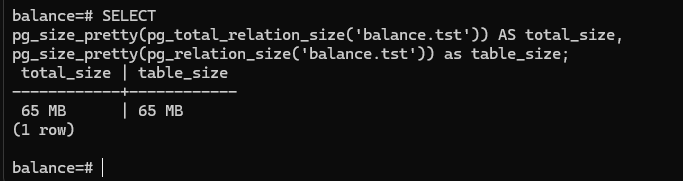

### 3. 5 раз обновляем все строчки 

```
DO $$ 
BEGIN
    FOR i IN 1..5 LOOP
        UPDATE balance.tst 
        SET data = data || 'c'; 
        RAISE NOTICE 'Iteration: %', i;  
    END LOOP;
END $$;

```

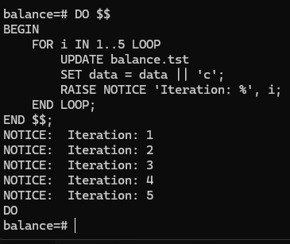

### 4. Смотрим число живых строчек и то, когда последний раз был AUTOVACUUM

```
SELECT relname, n_live_tup, n_dead_tup, last_autovacuum 
FROM pg_stat_user_tables WHERE schemaname = 'balance' and relname = 'tst'; 
```
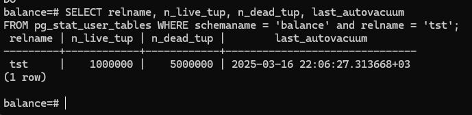

### 5. Жду пару минут и делаю повторный запрос

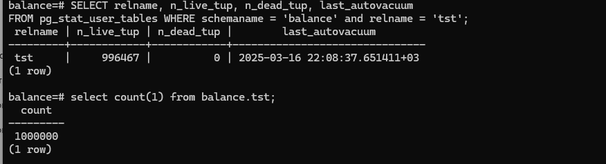

мертвых кортежей 0, а вот живых насчиталось даже меньше чем должно было. 


### 6. Еще раз обновляем все строчки 

```
DO $$ 
BEGIN
    FOR i IN 1..5 LOOP
        UPDATE balance.tst 
        SET data = data || 'a'; 
        RAISE NOTICE 'Iteration: %', i;  
    END LOOP;
END $$;

```

### 7. Смотрим размер таблицы 
```
SELECT 
pg_size_pretty(pg_total_relation_size('balance.tst')) AS total_size, 
pg_size_pretty(pg_relation_size('balance.tst')) as table_size;
```

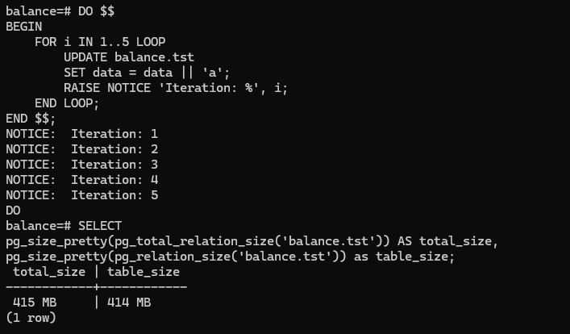


### 8. Отключаем автовакуум

```
ALTER TABLE balance.tst SET (autovacuum_enabled = false);
```

Проверяем, что все выключилось

```
SELECT reloptions FROM pg_class WHERE relname = 'tst' and  relnamespace = 'balance'::regnamespace;
```

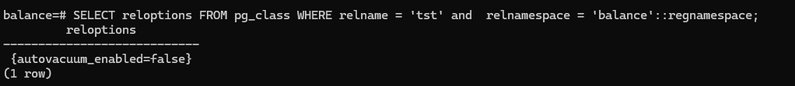

### 9. 10 раз обновляем все строчки 

```
DO $$ 
BEGIN
    FOR i IN 1..10 LOOP
        UPDATE balance.tst 
        SET data = data || 'a'; 
        RAISE NOTICE 'Iteration: %', i;  
    END LOOP;
END $$;
```

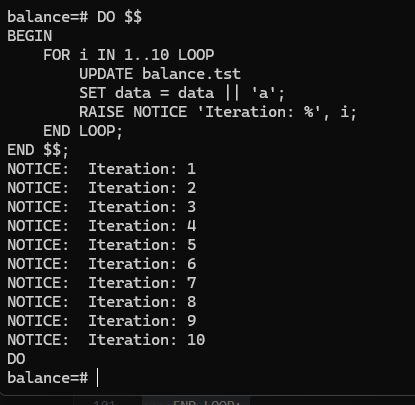

### 10. Смотрим размер таблицы:

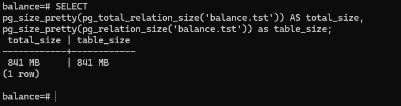

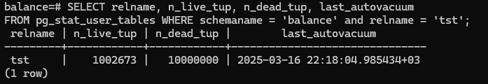

### 11. Объяснение 

Изначально таблица весила 65 Мб, поскольку MVCC в Postgres построено по принципу copy-on-write, то на каждое изменения кортежа вставляется новая версия старого кортежа (а не перезаписывается уже суцществующий). Таким образом, сделав 5 раз изменения всей таблицы, мы, фактически 5 раз перезаписали каждый кортеж с незначительными изменениями. Тем самым, таблица представляет собой 1 000 000 актуальных записей и 5 000 000 неактуальных. Умножая стартовые 65 Мб на 6 получаем примерно ~ 415 Мб (с учетом роста размера каждого кортежа из-за добавления символа). Стоит отметить и то, что несмотря на то, что AUTOVACUUM корректно отработал - он не удаляет физически с диска старые и ненужные записи, а лишь помечает их как доступные к перезаписи. Таким образом, физический размер таблицы на диске после AUTOVACUUM не сократился. После отключения AUTOVACUUM мы делаем 10 изменений в таблицу. Итого получаем 840 мб. Это можно объяснить так: из стартовых 415 Мб (до 10 изменений)  порядка 350 были помечены AUTOVACUUM'ом как доступные для перезаписи и таким образом были использованы в ~5 новых итерациях (из 10). Для остальных 5 итераций существующего места уже не было и поэтому пришлось расширять файл на диске. Как раз таки получается так, что до 10 изменений была следующая картина: 415 Мб из которых ~70 настоящие данные, остальные ~340 - помечены AUTOVACUUM, как доступные для перезаписи. Начинаем 10 итераций, первые 4-5 можно поместить в 340Мб, помеченных AUTOVACUUM, как доступных для перезаписи. Таким образом объем на диске на изменился. Для оставшихся 5-ти итераций изменения места уже не хватает и приходится расширять файл на диске, на них приходится примерно еще ~415Мб свыше c учетом того, что каждый раз размер одной записи растет. Так и получаем ~840Мб. Если же хотим, чтобы размер на диске уменьшился - надо сделать VACUUM FULL.

### 12. Включаем автовакуум

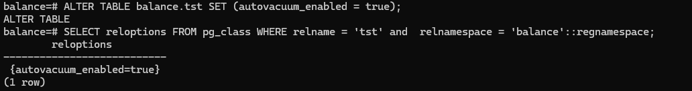


