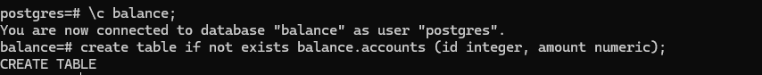
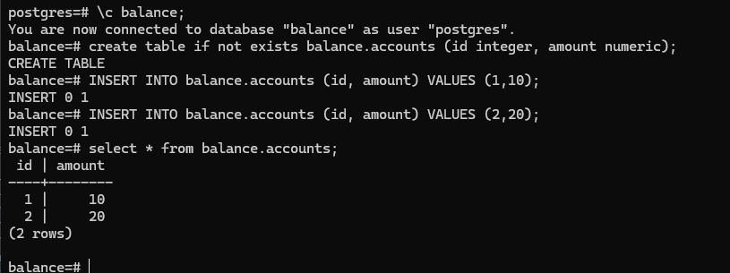
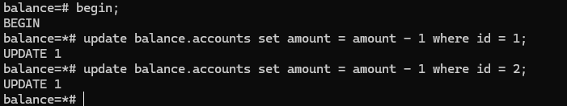
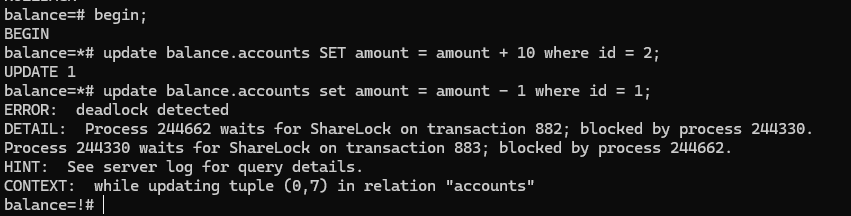
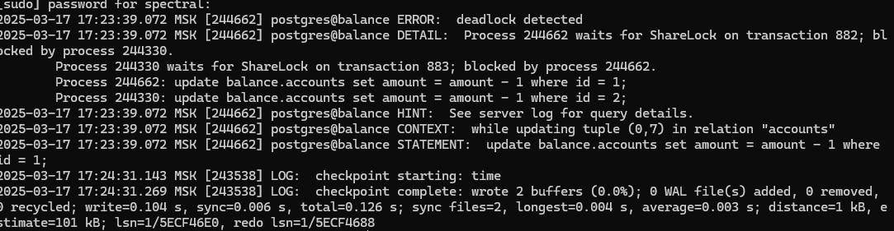

### 1. Создаем таблицу accounts 



### 2. Добавляем несколько записей



### 3. Подключаемся с двух терминалов





### 4. Просмотрим логи

```
sudo tail /var/log/postgresql/postgresql-17-main.log
```

