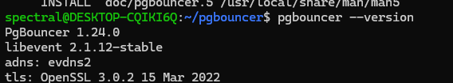
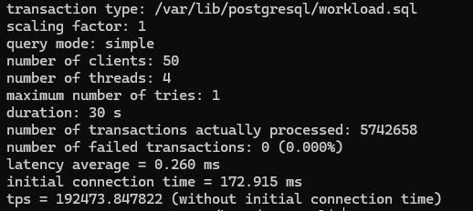
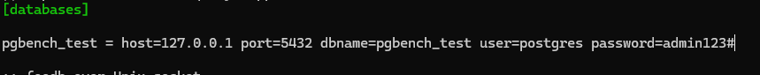
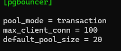
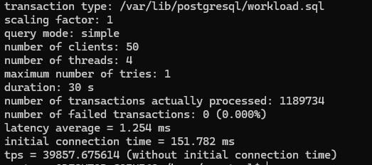
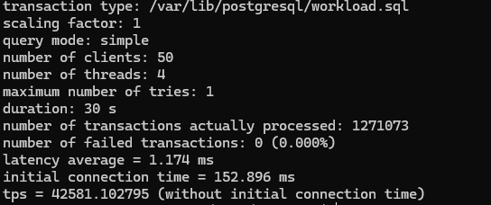
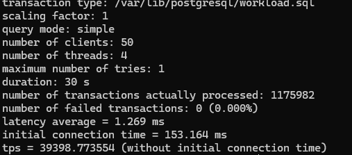

### 1 Установка pgbouncer 
Установил по руководстку с официального сайта проекта https://www.pgbouncer.org/install.html



### 2 Настраиваем pg_hba.conf

В целом, там уже автоматически проставлены все необходимые строки, которые дают свободно подключаться к postgres с локальной машины. 


### 3 В качестве БД будем использовать тайские перевозки
Запрос взят из лекции 
```
cat > ~/workload.sql << EOL
\set r random(1, 5000000) 
SELECT id, fkRide, fio, contact, fkSeat FROM book.tickets WHERE id = :r;
EOL
```

### 4 Проверим производительность без использования pg_bouncer

```
pgbench -c 50 -j 4 -T 30 -h 127.0.0.1 -p 5432 -f ~/workload.sql thai
```



### 6 Теперь настроим pg_bouncer

Заходим в ```etc/pgbouncer/pgbouncer.ini```





Также установим админ пользователя как postgres

Не забываем также добьавить логин и пароль в ```etc/pgbouncer/userlists.txt```

### 7 Проверим pgbench на уровне transaction 

```
pgbench -c 50 -j 4 -T 30 -h 127.0.0.1 -p 6432 -f ~/workload.sql thai
```



### 8 Проверим pgbench на уровне session


```
pgbench -c 50 -j 4 -T 30 -h 127.0.0.1 -p 6432 -f ~/workload.sql thai
```



### 9 Проверим pgbench на уровне statement




### Выводы 
Без использования PgBouncer:

Результат: 192,000 TPS (transactions per second).

Без PgBouncer производительность была значительно выше (192,000 TPS), что указывает на то, что без пула соединений сервер PostgreSQL может обрабатывать запросы более эффективно. Это может быть связано с меньшими накладными расходами на управление соединениями, так как каждое соединение устанавливается и обрабатывается без необходимости пулинга.

При использовании PgBouncer:

Режим statement: около 40,000 TPS.

Режим transaction: около 40,000 TPS.

Режим session: около 42,000 TPS.

Включение PgBouncer и использование пуллинга соединений значительно снижает производительность, что видно по результатам около 40,000 TPS. Это связано с накладными расходами, которые возникают из-за необходимости управления пулами соединений. В частности, время на создание и возврат соединений обратно в пул может замедлять обработку запросов, что приводит к снижению общей производительности.

В режиме statement и transaction производительность была схожей (около 40000 TPS), что может свидетельствовать о том, что оба этих режима имеют схожие накладные расходы на создание и возврат соединений.

Режим session показал наименьшее снижение производительности (42000 TPS), что указывает на то, что когда соединение сохраняется на время всей сессии, накладные расходы на управление соединениями минимальны, и производительность восстанавливается до более высоких значений по сравнению с режимами пула для транзакций и запросов.