### 1 Проверим производительность single instance на запись 
Запрос на вставку взял из лекции

```
INSERT INTO book.tickets (fkRide, fio, contact, fkSeat)
VALUES (
	ceil(random()*100)
	, (array(SELECT fam FROM book.fam))[ceil(random()*110)]::text || ' ' ||
    (array(SELECT nam FROM book.nam))[ceil(random()*110)]::text
    ,('{"phone":"+9' || (1000000000::bigint + floor(random()*9000000000)::bigint)::text || '"}')::jsonb
    , ceil(random()*100));
```

```
/usr/lib/postgresql/17/bin/pgbench -c 8 -j 4 -T 10 -f ~/workload2.sql -p 5432 thai
```

Результат 
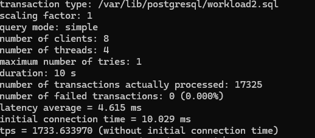

### 2 Проверим производительность single instance на чтение

Запрос (также из лекции)
```
\set r random(1, 5000000) 
SELECT id, fkRide, fio, contact, fkSeat FROM book.tickets WHERE id = :r;
```

```
/usr/lib/postgresql/17/bin/pgbench -c 8 -j 4 -T 10 -f ~/workload.sql -p 5432 thai
```
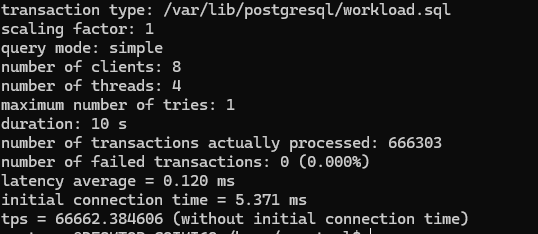

### 3 Настроим primary кластер для репликации 

## 1 Запускаем второй кластер на той же ВМ на порту 7432
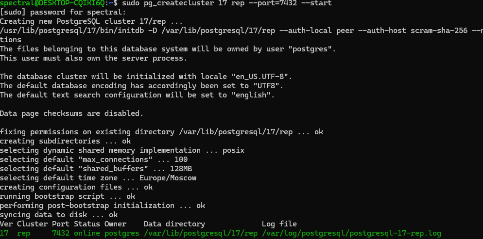
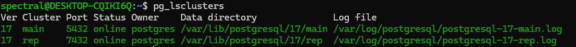

## 2 Проверим необходимые настройки в postgresql.conf
Все настройки оставил дефолтными, так как они подходят для выполнения учебного задания. 
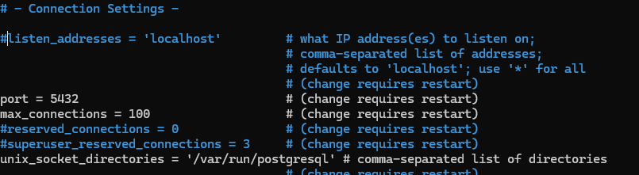

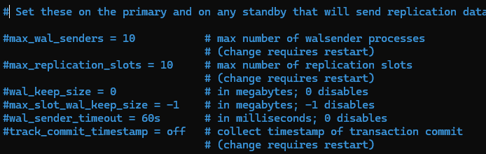

## 3 Создадим пользователя для репликации 
```
CREATE USER replica WITH REPLICATION ENCRYPTED PASSWORD 'replica123';
```

## 4 Явно создадим слот репликации 
```
SELECT pg_create_physical_replication_slot('replica_test');
```
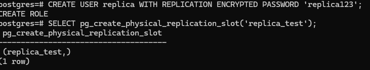

## 5 Добавим в pg_hba.conf информацию о пользователе, подготовленном для репликации

Оказалось, что pg_hba.conf уже автоматом добавлены все пользователи для репликации с localhost 

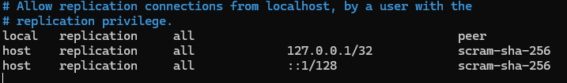

## 6 Остановим реплику 

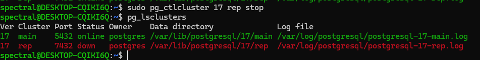

## 7 Очистим директорию реплики 

```
sudo rm -rf /var/lib/postgresql/17/rep

```


## 8 Запускаем pg_basebackup

```
pg_basebackup -h localhost -p 5432 -U replica -R -S replica_test -D /var/lib/postgresql/17/rep
```

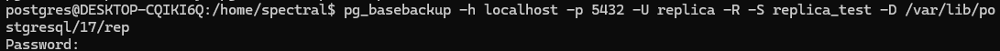

## 9 Запускаем реплику 
Проверяем, что репликация успешно работает
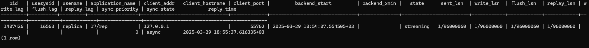
Видим, что ```sync_state``` = ```async```

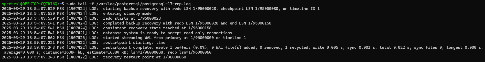

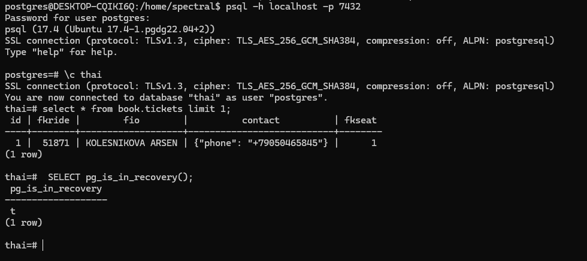

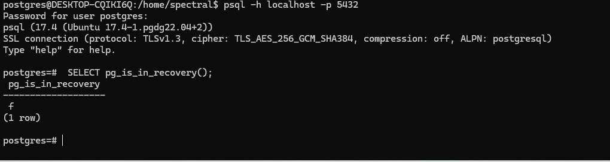

## 10 Проводим тесты на запись 

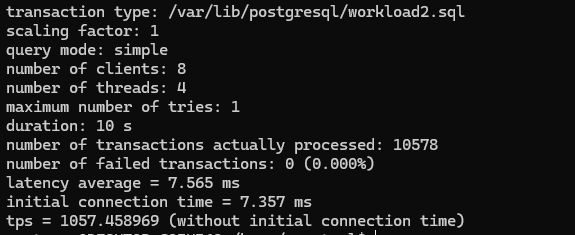

Видно падение на 7000 tps

## 11 Тест на чтение с мастера 

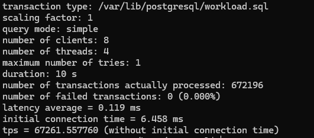

Не уступает чтению с сингл инстанса (что логично, при условии отстутсвия какой либо другой значимой нагрузки на мастер в этот момент)

## 12 Тест на чтение с реплики 

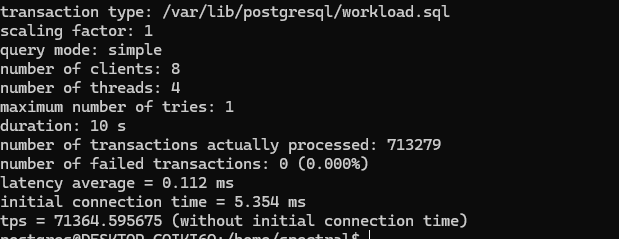

Получили даже немного больше, но в целом +- тоже самое 

### Вывод 
При создании реплики и использовании асинхронной физической репликации достаточно ощутимо упала скорость записи, скорость чтения же осталась такой же, а с реплики даже получилась чуть больше.