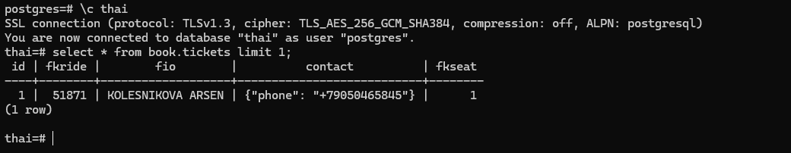
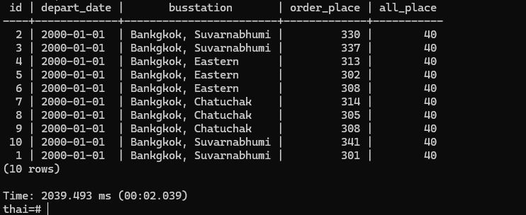
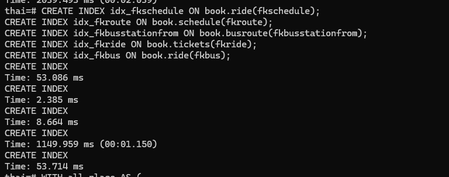
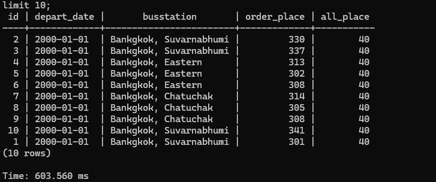

### 1 Зальем тайские перевозки
А в прочем, они уже залиты :)



### 2 Проверяем скорость исполнения запроса 
```
explain analyze
WITH all_place AS (
    SELECT count(s.id) as all_place, s.fkbus as fkbus
    FROM book.seat s
    group by s.fkbus
),
order_place AS (
    SELECT count(t.id) as order_place, t.fkride
    FROM book.tickets t
    group by t.fkride
)
SELECT r.id, r.startdate as depart_date, bs.city || ', ' || bs.name as busstation,  
      t.order_place, st.all_place
FROM book.ride r
JOIN book.schedule as s
      on r.fkschedule = s.id
JOIN book.busroute br
      on s.fkroute = br.id
JOIN book.busstation bs
      on br.fkbusstationfrom = bs.id
JOIN order_place t
      on t.fkride = r.id
JOIN all_place st
      on r.fkbus = st.fkbus
GROUP BY r.id, r.startdate, bs.city || ', ' || bs.name, t.order_place,st.all_place
ORDER BY r.startdate
limit 10;
```

Получаем такой explain 
```
                                                                        QUERY PLAN
-----------------------------------------------------------------------------------------------------------------------------------------------------------
 Limit  (cost=329681.63..329681.65 rows=10 width=56)
   ->  Sort  (cost=329681.63..330039.39 rows=143104 width=56)
         Sort Key: r.startdate
         ->  Group  (cost=324084.88..326589.20 rows=143104 width=56)
               Group Key: r.id, (((bs.city || ', '::text) || bs.name)), (count(t.id)), (count(s_1.id))
               ->  Sort  (cost=324084.88..324442.64 rows=143104 width=56)
                     Sort Key: r.id, (((bs.city || ', '::text) || bs.name)), (count(t.id)), (count(s_1.id))
                     ->  Hash Join  (cost=258384.20..306937.38 rows=143104 width=56)
                           Hash Cond: (r.fkbus = s_1.fkbus)
                           ->  Nested Loop  (cost=258379.09..305522.69 rows=143104 width=84)
                                 ->  Hash Join  (cost=258378.95..302117.02 rows=143104 width=24)
                                       Hash Cond: (s.fkroute = br.id)
                                       ->  Hash Join  (cost=258376.60..301712.49 rows=143104 width=24)
                                             Hash Cond: (r.fkschedule = s.id)
                                             ->  Merge Join  (cost=258333.20..301292.34 rows=143104 width=24)
                                                   Merge Cond: (r.id = t.fkride)
                                                   ->  Index Scan using ride_pkey on ride r  (cost=0.42..4555.42 rows=144000 width=16)
                                                   ->  Finalize GroupAggregate  (cost=258332.78..294588.12 rows=143104 width=12)
                                                         Group Key: t.fkride
                                                         ->  Gather Merge  (cost=258332.78..291726.04 rows=286208 width=12)
                                                               Workers Planned: 2
                                                               ->  Sort  (cost=257332.75..257690.51 rows=143104 width=12)
                                                                     Sort Key: t.fkride
                                                                     ->  Partial HashAggregate  (cost=220003.98..242631.75 rows=143104 width=12)
                                                                           Group Key: t.fkride
                                                                           Planned Partitions: 4
                                                                           ->  Parallel Seq Scan on tickets t  (cost=0.00..80953.45 rows=2170545 width=12)
                                             ->  Hash  (cost=25.40..25.40 rows=1440 width=8)
                                                   ->  Seq Scan on schedule s  (cost=0.00..25.40 rows=1440 width=8)
                                       ->  Hash  (cost=1.60..1.60 rows=60 width=8)
                                             ->  Seq Scan on busroute br  (cost=0.00..1.60 rows=60 width=8)
                                 ->  Memoize  (cost=0.15..0.36 rows=1 width=68)
                                       Cache Key: br.fkbusstationfrom
                                       Cache Mode: logical
                                       ->  Index Scan using busstation_pkey on busstation bs  (cost=0.14..0.35 rows=1 width=68)
                                             Index Cond: (id = br.fkbusstationfrom)
                           ->  Hash  (cost=5.05..5.05 rows=5 width=12)
                                 ->  HashAggregate  (cost=5.00..5.05 rows=5 width=12)
                                       Group Key: s_1.fkbus
                                       ->  Seq Scan on seat s_1  (cost=0.00..4.00 rows=200 width=8)
 JIT:
   Functions: 51
   Options: Inlining false, Optimization false, Expressions true, Deforming true
(43 rows)
```

Само время выполнения запроса:



### 3 Навесим индексы на внешние ключи 


### 4 Запустим запрос еще раз 


Получили ощутимое ускорение. Благодаря индексам join'ы и группировки в CTE стали ощутимо быстрее. 
